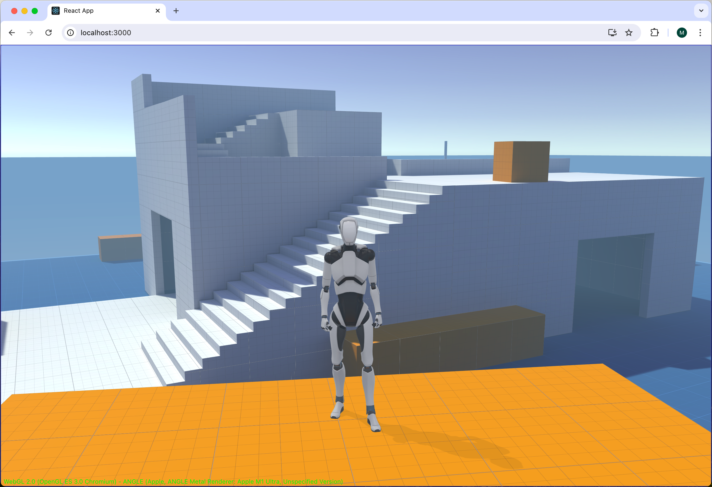

# Using Exported Unity Content




## Babylon Toolkit Extension

A universal runtime library for advanced BabylonJS game development.

https://github.com/BabylonJS/BabylonToolkit


## Unity Asset Store

The Starter Assets are free and light-weight first and third person character base controllers for the latest Unity 2023 LTS Or Greater

https://assetstore.unity.com/packages/essentials/starter-assets-character-controllers-urp-267961


## Default Installation (ES6)
```bash
npm install
npm run dev
```

* Core Module Import Libraries
```javascript
import { Engine, Scene } from "@babylonjs/core";
import { HavokPlugin } from "@babylonjs/core/Physics/v2/Plugins/havokPlugin";
import HavokPhysics from "@babylonjs/havok";
import { SceneManager, ScriptComponent, InputController } from "@babylonjs-toolkit/next";
```

* Granular File Level Import Libraries
```javascript
import { Engine } from "@babylonjs/core/Engines/engine";
import { Scene } from "@babylonjs/core/scene";
import { HavokPlugin } from "@babylonjs/core/Physics/v2/Plugins/havokPlugin";
import HavokPhysics from "@babylonjs/havok";
import { SceneManager } from "@babylonjs-toolkit/next/lib/core/managers/scenemanager";
import { ScriptComponent } from "@babylonjs-toolkit/next/lib/core/managers/scenemanager";
import { InputController } from "@babylonjs-toolkit/next/lib/dom/managers/inputcontroller";
import { WindowManager } from "@babylonjs-toolkit/next/lib/dom/managers/windowmanager";
```

* Legacy Global Namespace Import Libraries
```javascript
import * as BABYLON from "@babylonjs/core";
import { HavokPlugin } from "@babylonjs/core/Physics/v2/Plugins/havokPlugin";
import HavokPhysics from "@babylonjs/havok";
import * as TOOLKIT from "@babylonjs-toolkit/next";
```

* TypeScript Configuration Settings (tsconfig.json)
```json
"types": [
    "@babylonjs/core",
    "@babylonjs/gui",
    "@babylonjs/havok",
    "@babylonjs/loaders",
    "@babylonjs/materials"
]
```
